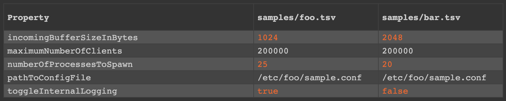

# props-diff

Console tool made in Node.js that compares two TSV files containing properties (i.e., a collection of key-value pairs) and shows an HTML summary of the comparison, highlighting fields that differ and that are also missing.

Useful for comparing configurations of different system environments (helps answering the question of why some bug manifests in production but not in staging, for instance).

For security reasons, fields whose names mention "password" or "secret" have their values automatically removed from the output HTML.

This tool is still in its early stages, so some assumptions are made:

- files are in TSV format
- files are encoded in UTF-8
- columns are **not** surrounded by quotes
- first row is **not** headers, but data

## How to use

You must have `nvm` installed. To install props-diff:

    nvm install
    npm install

Then run it:

    node props-diff <file1> <file2> <name-column-index> <value-column-index>

First two params are the paths to the files to compare, the third param is the index of the column supposed to contain the name and the fourth param is the index of the column that holds the value. Column indexes are zero-based.

Example (check the samples directory):

    node props-diff.js samples/foo.tsv samples/bar.tsv 0 1

## To do

- get rid of the Node.js part, make it work using only the browser
